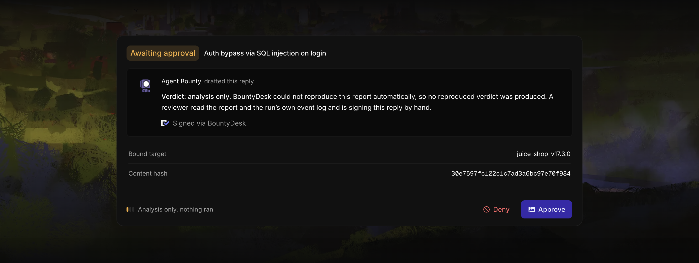
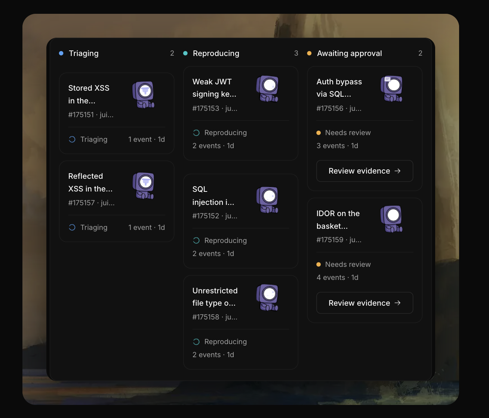
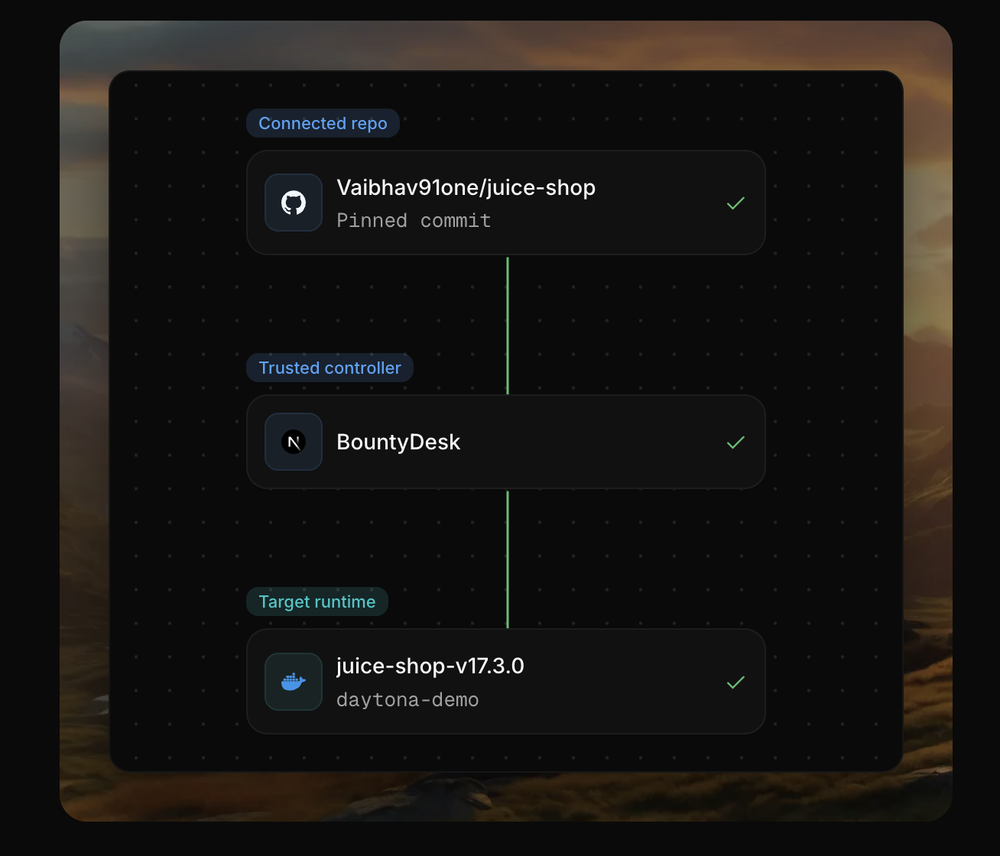
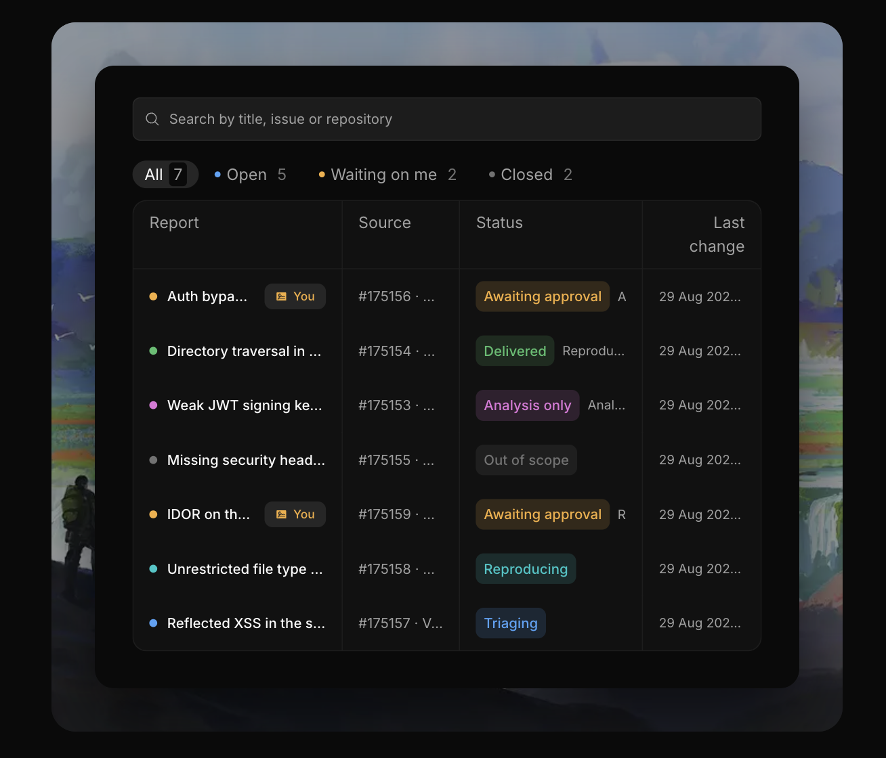

<h1 align="center">
  
  <br>
  BountyDesk
  <br>
  <small>The agent investigates. A human signs.</small>
</h1>

<p align="center">
  <a href="https://github.com/Vaibhav91one/bountydesk/actions/workflows/ci.yml"></a>
  
  
  
</p>

<p align="center">
  Agent-assisted bug-bounty triage. Authenticate the report, check scope, bind a
  server-owned target, let a TrueForge agent investigate in a sandbox, and ship
  a comment only after a human signs the exact text.
</p>

<p align="center">
  <a href="https://youtu.be/tgpWKCdM5a8"><b>Demo video</b></a>
  &nbsp;&middot;&nbsp;
  <a href="https://dev.to/vaibhav_tomar_b2fc1fcbe38/bountydesk-agent-led-bug-bounty-triage-with-a-human-approved-verdict-43lm"><b>Write-up</b></a>
</p>

<p align="center">
  Built on the <a href="https://trueforge.dev">TrueForge</a> agent harness for
  the WeMakeDevs x TrueFoundry x Qodo Agent Harness Hackathon (Aug 2026).
</p>

<p align="center">
  Demo recording is not linked yet.
  Live operator path: <a href="docs/demo-runbook.md"><code>docs/demo-runbook.md</code></a>.
</p>

<p align="center">
  
</p>

<p align="center">
  
  &nbsp;
  
  &nbsp;
  
  &nbsp;
  
</p>

## How a report moves

| | Step | What happens |
|:---:|---|---|
|  | Intake | Signed GitHub App webhook. GitHub issue intake is live. Email and upload are designed, not wired. |
|  | Queue | Durable Postgres job. Worker leases the row and opens a TrueForge session. |
|  | Investigate | Agent uses scope-guard, sandbox, skills, and probes against the bound target. |
|  | Draft | Agent calls approval-gated `publish_verdict`. Nothing is posted yet. |
|  | Deliver | Reviewer Allow. Idempotent GitHub comment. Replay of the same delivery is a no-op. |

<p align="center">
  
</p>

Intake and reproduction are separate. Reproduction needs a server-authorised `TargetProfile`. A report with no bound target, or one whose repository grant has been revoked, stops at `ANALYSIS_ONLY`. The platform refuses a reproduced or not-reproduced verdict for that report, whatever the agent asserts.

The demo target is the connected fork `Vaibhav91one/juice-shop`, pinned to commit `1867b926c5f50e4e692dc9c8f61821413cebe0cd` (`v17.3.0`). It is built ahead of time and run from an immutable Daytona snapshot, so the reproduction sandbox does not clone or install dependencies during the demo.

<p align="center">
  
</p>

<div align="center">

| Invariant | Meaning |
|---|---|
|  No bound target, no reproduced verdict | Capability boundary, not the agent's claim |
|  No human approval, no GitHub comment | Human gate is never skippable |

</div>

## Status

<p align="center">
  One real GitHub issue. One real Daytona sandbox run. One approved GitHub comment. Zero duplicates on webhook replay.
</p>

The deterministic canary pipeline reproduced the Juice Shop SQL injection scenario from a real GitHub issue and delivered an approved comment on [`Vaibhav91one/juice-shop#5`](https://github.com/Vaibhav91one/juice-shop/issues/5). Replaying the same webhook delivery produced no second report and no second comment.

The live path is now agent-authored. The TrueForge agent investigates and drafts its own outcome, summary, and findings. That code is merged. It still needs one fresh live run before it should be called live-proven. The canary pipeline is kept as a stronger evidence source, not as today's default path.

<p align="center">
  
</p>

| | Area | Honest status |
|:---:|---|---|
|  | GitHub issue intake + SQLi canary proof | Proven live, including webhook replay |
|  | Agent-authored `publish_verdict` | Merged, not yet live-proven |
|  | Login bypass scenario | Implemented, not live-proven |
|  | Email and file-upload intake | Designed, not wired |
|  | Arbitrary-repository build tier | Designed, not shipped |
|  | DVWA, WebGoat, CVE labs | Practice targets unless bound, approved, and delivered as report-shaped runs |
|  | Daytona | Hackathon demo sandbox layer, not the production isolation story |

## What TrueForge does here

TrueForge is the agent workflow, not a prompt wrapper.

| Surface | Used for |
|---|---|
| Sessions | One persistent investigation per report |
| MCP tools | Scope checks, target probes, and verdict drafting |
| Sandbox | A place for the agent to run investigation steps |
| Skills | Reusable target and triage instructions |
| Subagents | Split work during deeper investigations |
| Approvals | Pause before `publish_verdict` can become an outbound comment |

The final comment is not prefilled by the server. The agent writes it. The platform re-checks authorization before accepting any reproduced or not-reproduced claim. The reviewer signs the exact bytes that will be delivered.

### MCP servers and skills in this repo

BountyDesk ships the tools the agent uses, so the harness has real capabilities to grant rather than stubs.

Two MCP servers:

- `publish-verdict` (`app/api/mcp/publish-verdict`) exposes the approval-gated `publish_verdict` tool the agent calls to draft its outcome, summary, and findings.
- `scope-guard` (`app/api/mcp/scope-guard`) holds the authorized scope and exposes `probe_target`, the approval-gated `probe_target_write`, and the scope checks. It is ported and hardened from the Sentinel prototype.

Twelve agent skills under `skills/`: recon, triage, validation, api-security, payloads, dast, challenges, cve-lab-construction, firmware, mobile, demo-targets, and target-onboarding. They are wired by `agent/bountydesk.agent.json` and registered with `npm run skills:apply` and `npm run agent:apply`.

## What is built

| | Piece |
|:---:|---|
|  | Signed GitHub App issue intake |
|  | Installation lifecycle handling and repository grant checks |
|  | Postgres schema, durable queue, leases, workers, and delivery outbox |
|  | Reviewer GitHub OAuth with an allowlist |
|  | TrueForge session, turn, polling, approval, and delivery flow |
|  | `publish_verdict`, `scope-guard`, `probe_target`, and approval-gated `probe_target_write` |
|  | Agent skills, subagents, sandbox-enabled manifest, and harness settings UI |
|  | Case files with lifecycle, findings, artifacts, mirrored agent steps, and live tool-call detail |
|  | Registered target profiles, including validated dynamic target manifests for manual setup |

## Getting started

```bash
npm install
npm run dev
```

Open [http://localhost:3000](http://localhost:3000). The landing page shows the product promise and the split between intake, investigation, approval, and delivery.

A real demo run needs a database, a GitHub App, TrueForge, and Daytona. See [`docs/demo-runbook.md`](docs/demo-runbook.md).

### Requirements

| Need | Detail |
|---|---|
| Node.js | 22 or newer |
| npm | Project package manager |
| Postgres | App on `DATABASE_URL` (port 6543), migrations on `DIRECT_URL` (port 5432) |
| GitHub App | Metadata read, Issues read/write |
| TrueForge | Harness on `http://localhost:8790` |
| Daytona | Credentials for the reproduction sandbox |

### Local run

```bash
cp env.example .env.local
npm install
npm run db:migrate
npm run dev
```

In another terminal:

```bash
npx @truefoundry/trueforge@latest
```

Then configure the model and sandbox provider at `/settings`, register managed
harness resources, bind the demo repository, and start the worker. The demo seed
command below uses the committed Juice Shop profile, so `.env.local` must
contain real immutable target pins before it runs: `DAYTONA_TARGET_IMAGE_DIGEST`
and `DAYTONA_TARGET_SNAPSHOT_ID`, or their
`BOUNTYDESK_TARGET_JUICE_SHOP_V17_3_0_*` equivalents. For any non-demo target,
pass a reviewed target manifest with `--manifest <path>` and set the matching
`BOUNTYDESK_TARGET_<ENV_PREFIX>_*` pins.

```bash
npm run skills:apply
npm run agent:apply
npm run seed:target -- 1347703889
npm run worker:daemon
```

Copy `env.example` to `.env.local` and fill it in. Only the database block is required to boot the app. Do not commit real secrets.

| Doc | What it is |
|---|---|
| [Demo runbook](docs/demo-runbook.md) | Operator path for a live run |
| [Decisions](docs/decisions.md) | Design record, Q1 to Q21 |
| [Plan](docs/plan.md) | What is proven and what is still open |
| [Deployment](docs/deployment.md) | How the app is hosted |
| [Target profiles](docs/target-profiles.md) | How a target is bound |
| [Submission blog draft](docs/blog-post.md) | Hackathon post draft |
| [Contributing](./CONTRIBUTING.md) | PR and review rules |

## Qodo Code Review Evidence

Every substantive change lands through a pull request reviewed by Qodo before merge. Branch protection requires the `build` and `qodo-reviewed` checks, and direct pushes to `main` are blocked.

| PR | What Qodo found | What changed |
|---|---|---|
| [#4](https://github.com/Vaibhav91one/bountydesk/pull/4) signed GitHub App webhook and installation lifecycle | Two High-severity intake bugs: a redelivered installation event could restore access after uninstall, and a suspension could race between access check and enqueue | Transactional lifecycle handling, row locks, and concurrency tests |
| [#22](https://github.com/Vaibhav91one/bountydesk/pull/22) wire the real TrueForge approval flow into report processing | Deadline and cleanup problems in the approval loop | Retries escalate correctly, timeout comments stay honest, harness stops when a deadline path exits |
| [#31](https://github.com/Vaibhav91one/bountydesk/pull/31) add the reproduction orchestrator and real oracle | Unsafe header override handling, lost dispatched body hashes, brittle readiness and cleanup | Hardened oracle contract and coverage for the report-shaped reproduction flow |
| [#39](https://github.com/Vaibhav91one/bountydesk/pull/39) split `publish_verdict` into draft and approval execution paths | Invalid drafts could still use an older path; approval screen hid important verdict outcome data | Agent drafting and human execution are distinct; review shows the relevant outcome |
| [#53](https://github.com/Vaibhav91one/bountydesk/pull/53) provision a reachable target sandbox and add `probe_target` | Weak boundary between read probes and state-changing target calls | `probe_target_write` is approval-gated; read-only inspection stays available |
| [#59](https://github.com/Vaibhav91one/bountydesk/pull/59) support registered target profiles | Caller-selected target names could bind or rotate the wrong repository profile | Repository-to-profile mapping is derived and verified server-side |
| [#60](https://github.com/Vaibhav91one/bountydesk/pull/60) settings screen for all five TrueForge harness surfaces | Form and operator-flow bugs in the harness setup path | Timeout validation split from lifecycle intervals, malformed model lists handled safely, UI wording matches the harness |

## Disclosure: AI use

This project was built with AI coding assistance under human direction. All changes are human-reviewed and merged through the Qodo-reviewed pull-request process. Security-sensitive logic, including scope enforcement, intake authentication, delivery idempotency, and the approval gate, carries tests.

## License

No license file is committed yet.
