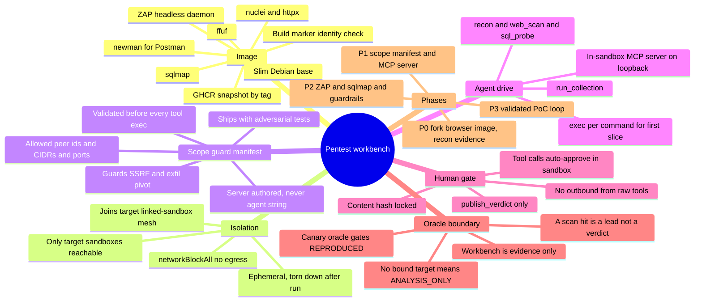
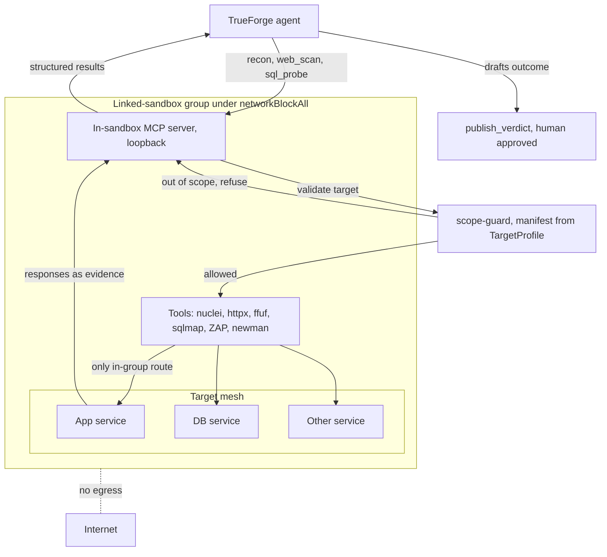

# Pentest workbench

A proposal for an agent-driven tool sandbox that BountyDesk joins to a target so the agent can run
real offensive tooling against it, not just HTTP probes. This is a design record, not a commitment
to build. It captures what the landscape shows, the shape that fits BountyDesk, the one new trust
boundary it needs, and a phased path.

## Context

Reproduction today reaches a target one way: `probe_target` (GET/HEAD) and `probe_target_write`
(POST) forward HTTP to the target sandbox, and a deterministic canary oracle decides `REPRODUCED`.
That is deliberate and it is enough for a large class of web bugs. It is not enough for two cases.
A DOM or SPA bug never fires under a plain fetch, which is why the browser probe exists. And a bug
that lives below HTTP, or across several services, wants tools an HTTP forwarder cannot express: a
port scan, a template scanner, an injection tool, a Postman collection run against an API.

The idea that prompted this: bake one image with the security stack wired in, hand it to the agent
inside a sandbox, and network-join that sandbox to the target. The target can be multi-container,
each service with its own address, and the agent works the whole thing. The intended outcome is a
reproduction and analysis layer that can investigate a target the way a human tester would, without
loosening any of the boundaries that make BountyDesk safe to run.

## What the landscape shows

Autonomous agents driving real offensive tools are past the proof-of-concept stage as of 2025-2026.

- XBOW is a fully autonomous pentester that reached [#1 on HackerOne's US leaderboard](https://xbow.com/blog/top-1-how-xbow-did-it),
  then #1 globally, and [raised a $75M Series B](https://xbow.com/blog/series-b). Its
  [safety design](https://xbow.com/blog/autonomous-agent-safety-guardrails) is the part worth
  studying: scope is locked at launch with no runtime path for the agent to widen it, a DNS-layer
  egress proxy classifies every domain and blocks out-of-scope lookups, an independent Guardian
  model vets each action outside the solver's reasoning, and every action lands in an immutable
  audit trail.
- [Strix](https://github.com/usestrix/strix) is the closest open-source analogue: a multi-agent
  pentester that runs tools in a Docker sandbox and validates findings with real proofs of concept.
- [CAI](https://github.com/aliasrobotics/cai) and [NodeZero](https://horizon3.ai/nodezero/) both
  deliver a proof of exploit rather than a CVSS score, and NodeZero re-tests to confirm a fix.
- [HexStrike AI](https://github.com/0x4m4/hexstrike-ai) is the cautionary tale, and it is the exact
  shape this proposal starts from: one MCP server exposing 150-plus tools to any client. Check Point
  reported a [threat actor weaponizing it](https://blog.checkpoint.com/executive-insights/hexstrike-ai-when-llms-meet-zero-day-exploitation/)
  to exploit a Citrix CVE in under ten minutes. The value and the danger are the same mechanism. The
  only thing that separates them is the scope and egress boundary around the tools.

The takeaway is that the hard part is not the tools or the agent. It is the boundary. The serious
players spend most of their safety engineering reproducing three things BountyDesk already has: a
capability boundary that binds scope server-side, an ephemeral sandbox with no egress, and a human
gate on the one outbound action.

## The recommended design

Reuse the browser-probe pattern almost verbatim. That image (Chromium and webcmd baked into a
Daytona snapshot, no egress, link-joined to the target, identity re-checked in the sandbox with a
build marker) is the template for a BountyDesk-owned tool image the agent drives against an
isolated target.

The image is a slim Debian base with about ten tools, not a hundred and fifty: nuclei and httpx for
scanning and probing, ffuf for content discovery, sqlmap for injection, OWASP ZAP in daemon mode
for active and passive scanning, and newman for Postman collections against API targets. Go
single-binaries are cheap; the heavy items (a full Kali base, Metasploit, large wordlist sets) are
left out until a phase actually needs them. It is pushed to GHCR and registered as a Daytona
snapshot by tag, and its identity is re-verified from inside the booted sandbox with a build marker,
exactly as the target and browser-probe images are.

Network placement is the piece that is already built. The workbench sandbox joins the target's
linked-sandbox group under `networkBlockAll`, the mesh that is proven live. The only hosts it can
reach are the target sandboxes, addressable by sandbox-id DNS on the private in-group route, and the
internet is simply absent. This is a stronger egress story than a DNS blocklist proxy, because there
is no egress path to block. A multi-container target, each service on its own address, is the
substrate the mesh already provides.

The agent drives the workbench through an MCP server on loopback inside the sandbox, which exposes a
small set of tools such as `recon`, `web_scan`, `sql_probe`, and `run_collection`. That is a cleaner
surface than a bespoke exec call per binary, it returns structured results, and it is the natural
place to validate scope on every call. A first slice can drive tools by exec, the way the browser
oracle drives webcmd, before the MCP server exists.

The human gate does not move. `publish_verdict` stays the only approval-gated, content-hash-locked
outbound action. Raw tool output never leaves the sandbox on its own; it is context the agent uses
to draft a verdict a human still approves. Workbench tool calls auto-approve inside the sandbox for
the same reason `probe_target_write` does: the sandbox is offline and torn down after the run, so
there is nothing outside it for a human to protect. The gate that guards the outside world is the
verdict, and the workbench never touches it.

## The one new trust boundary

Everything above reuses existing machinery except one thing. Today's scope binding is HTTP-shaped:
`probe_target` forwards a request to the target the server-held `TargetProfile` names. Raw tools
break that assumption, because nmap wants an IP and sqlmap wants a URL with parameters, not a single
forwarded request.

So scope-guard has to grow. The `TargetProfile` gains a scope manifest: the allowed peer sandbox
ids, hostnames, CIDRs, and ports of the mesh, authored server-side, never taken from a string the
agent produced, the same invariant that binds the target today. The in-sandbox MCP server validates
every tool's target against that manifest before it runs, and refuses a target outside it
server-side, the way a `REPRODUCED` with no bound target is refused now.

This is the one genuinely new boundary, and it is what stops the workbench from becoming an SSRF,
exfiltration, or third-party-attack pivot. It is security-sensitive and it lands with adversarial
tests, per the repo rule that puts the scope guard on the mandatory-test list. Because the sandbox
has no internet, the manifest is defense in depth over an already-closed boundary rather than the
sole control, which is the honest and strong version. An XBOW-style Guardian check on destructive
actions can sit on top, but it is a soft model control; the hard controls are the no-egress mesh and
the manifest.

## The honest conflict

Active scanning is non-deterministic. The same run against the same target yields different findings,
and that fights BountyDesk's identity as a deterministic oracle. The resolution is to refuse to let
the workbench be a source of truth. It is an evidence and lead generator. A nuclei, sqlmap, or ZAP
hit is a hypothesis the agent uses to build a reproduction the canary oracle can confirm, never a
verdict on its own. No bound target still means `ANALYSIS_ONLY`, and workbench output cannot change
that. The oracle stays the sole gate for `REPRODUCED`.

## On Burp

Do not bake Burp. Burp Community has no active scanner, which is the capability an autonomous agent
most wants. Burp Professional has it, but it is $499 per user per year, a per-seat license, and its
[official MCP server](https://github.com/portswigger/mcp-server) runs as an extension that needs the
Burp GUI running; headless is second-class and unattended CI belongs to the pricier Enterprise and
DAST products. A per-seat, GUI-bound license running unattended in every ephemeral sandbox is both a
licensing problem and an operational one. OWASP ZAP is the fit: free, Apache-2.0, runs headless as a
daemon, has a mature automation API, and has [guardrail-aware MCP wrappers](https://github.com/dtkmn/mcp-zap-server)
already. Burp stays a tool a researcher runs on their own desk.

## Risks and open questions

- Scope-manifest correctness is the load-bearing risk. A mis-scoped mesh, a peer that should not be
  in scope, is the one way the boundary leaks, so the manifest is server-authored and tested.
- Non-determinism, addressed above by keeping the workbench as evidence only.
- Image size and cost. A full Kali base is several gigabytes; snapshot storage and cold start grow
  with it, so the image stays slim and tools are added per phase, not up front.
- Tool licensing, addressed by choosing ZAP, nuclei, newman, and other OSS tools over Burp Pro and
  commercial scanners.
- Target health. Active scans can knock a target over. This matters less here because the target is
  disposable and offline, but NodeZero's safe-by-default posture and XBOW's health auto-pause are
  worth borrowing if a phase adds heavier tools.

## Phased path

Stop at the first phase that pays off. If Phase 0 does not measurably improve verdict quality, the
heavier phases are not justified.

- Phase 0, the smallest useful slice. Fork the browser-probe image build, bake nuclei, httpx, and
  newman only, join it to an existing target mesh under `networkBlockAll`, drive it by exec, and
  feed the output to the agent as evidence. The oracle is unchanged. This proves a workbench sandbox
  can join the mesh, reach only the target, and hand the agent useful recon. It ships with a scope
  test.
- Phase 1, the scope manifest and the in-sandbox MCP server, validating every target against the
  manifest. This is the security-sensitive core, and the manifest enforcement is what the tests
  cover.
- Phase 2, heavier tools. ZAP in daemon mode for active and passive scanning, sqlmap, dalfox, wider
  recon, wired through the guardrail-aware MCP pattern, with an optional Guardian check on
  destructive actions.
- Phase 3, the validated-PoC loop. The agent chains workbench findings into a reproduction the
  canary oracle confirms, the way NodeZero proves and re-tests. Only here does the workbench
  materially raise `REPRODUCED` yield.

## Mind map

## Runtime architecture

